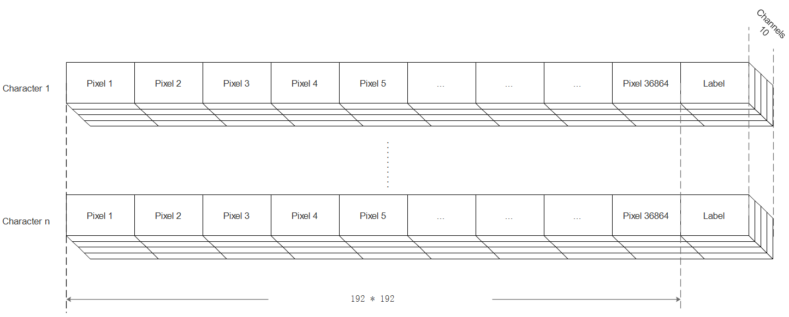
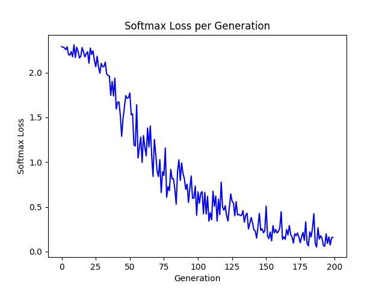
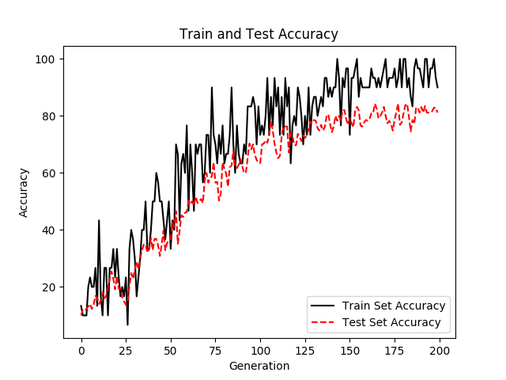
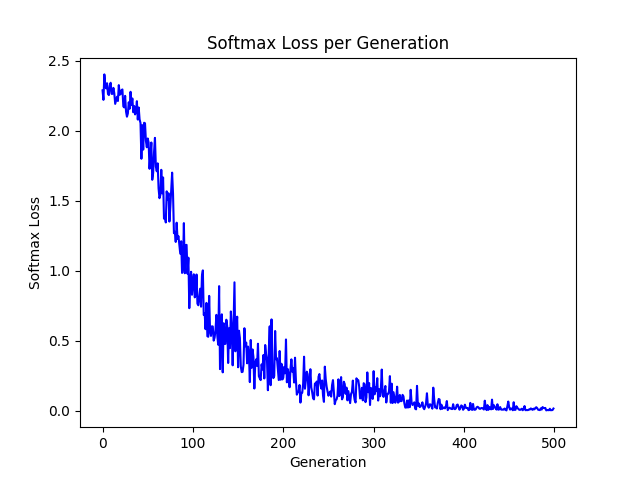
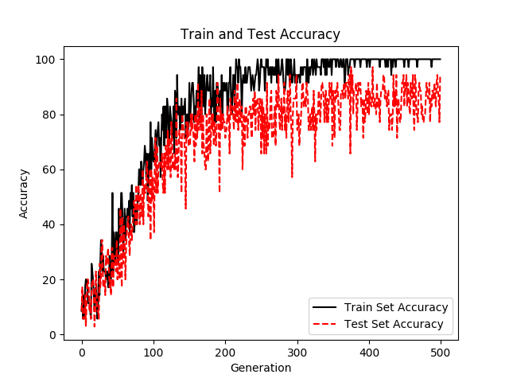

# Project-CNN

This is the project on handwritten Chinese character recognition using CNN supervised by Dr. Jionglong Su.

## Problem needs solving:

1. 8 directional gradient extraction
2. construction of CNN
   - Use slim interface whose graph is much clear when visualization and much easier to construct
3. prevention of over fitting
   - ReLu
   - penalty term ?
   - cross validation
   - ...
4. Dataset construction
   - Need to store in a 3-D form (width, height, channels) which is easy to read into program
   - Try to store data into .mat file from which data can be read in 3-D for directly by [scipy.io](https://docs.scipy.org/doc/scipy-0.19.1/reference/io.html)
   

## Some sources:

1. An awesome website for visualized CNN: http://scs.ryerson.ca/~aharley/vis/conv/

## Experiment:

### Experiment result
1. First experiment setting:
   - Batch size = 30
   - Training Epoch = 200
   - Training Samples = 500
   - Testing Sample = 350 (no batch in testing)

2. Second experiment setting:
   - Batch size = 30
   - Training Epoch = 500
   - Training Samples = 500
   - Testing Sample = 350 (batch size = 30 in testing)

### Experiment Notes:
1. 7th Aug
   - When samples are added up to 500 from 220, the loss converges better.
   - Adjustment batch size cannot resolve the problem of sever oscillation of testing accuracy.
   - It might be possible to use more samples to train for a better performance as the ratio of 
