# Project-CNN

This is the project on handwritten Chinese character recognition using CNN supervised by Dr. Jionglong Su.

## Problem needs solving:

1. 8 directional gradient extraction
2. construction of CNN
   - Use slim interface whose graph is much clear when visualization and much easier to construct
3. prevention of over fitting
   - ReLu
   - penalty term ?
   - cross validation
   - ...
4. Dataset construction
   - Need to store in a 3-D form (width, height, channels) which is easy to read into program
   - Try to store data into .mat file from which data can be read in 3-D for directly by [scipy.io](https://docs.scipy.org/doc/scipy-0.19.1/reference/io.html)
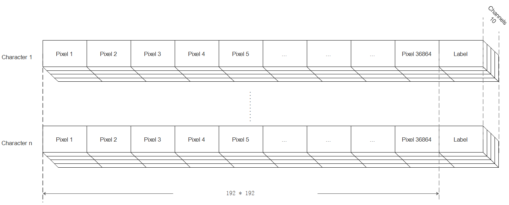
   - Following are 3 samples of handwritten character '啊'.

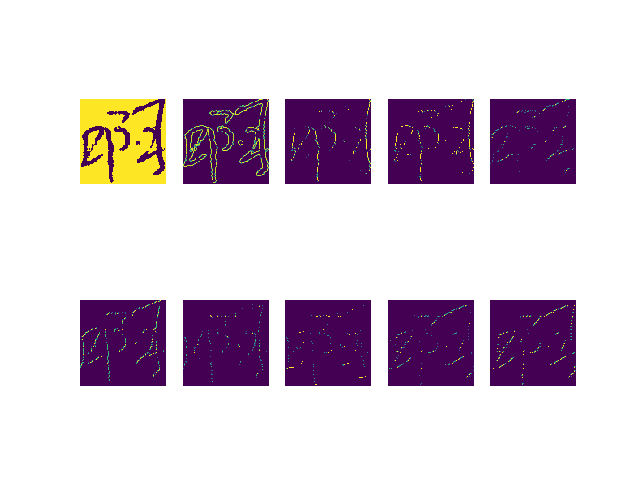
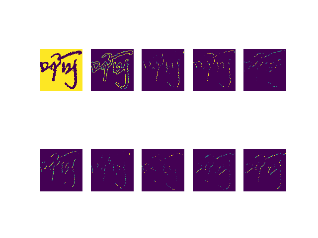

## Some sources:

1. An awesome website for visualized CNN: http://scs.ryerson.ca/~aharley/vis/conv/

## Experiment:

### Experiment result
1. First experiment setting:
   - Batch size = 30
   - Training Epoch = 200
   - Training Samples = 500
   - Testing Sample = 350 (no batch in testing)
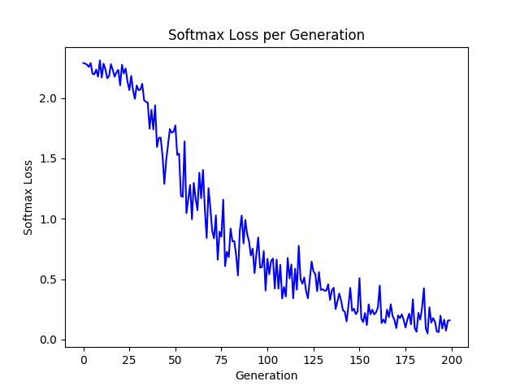
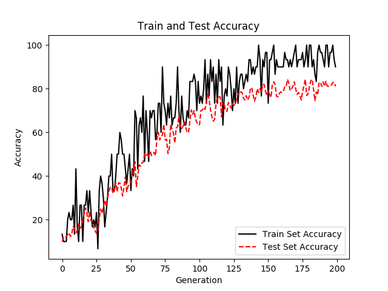

2. Second experiment setting:
   - Batch size = 35
   - Training Epoch = 500
   - Training Samples = 500
   - Testing Sample = 350 (batch size = 30 in testing)
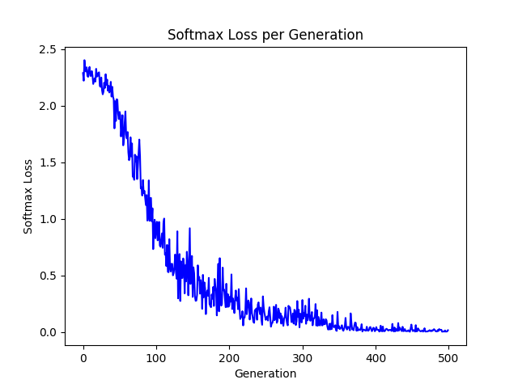
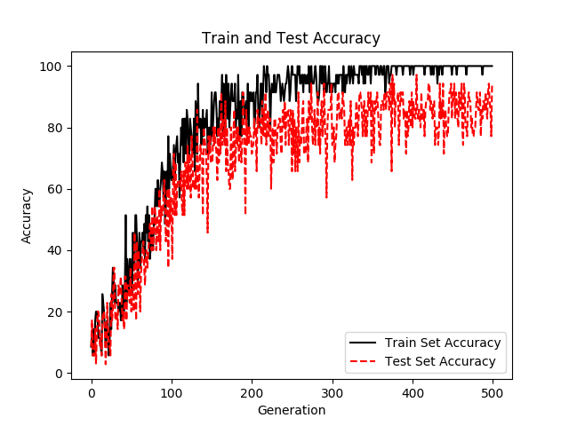

3. Results from work station are not satisfactory
The testing accuracy settles around only 93~94%

Epoch:2400  Batch size:25

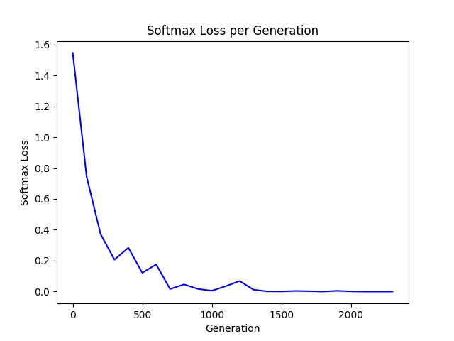
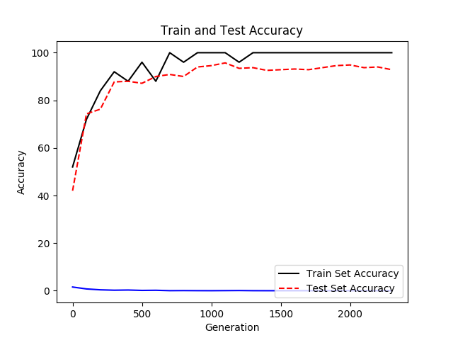

Epoch:1200  Batch size:50

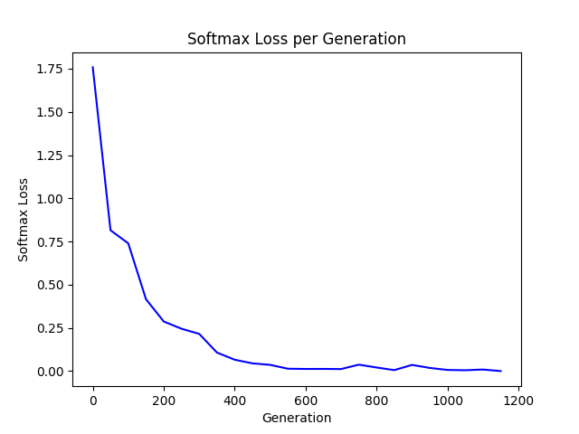
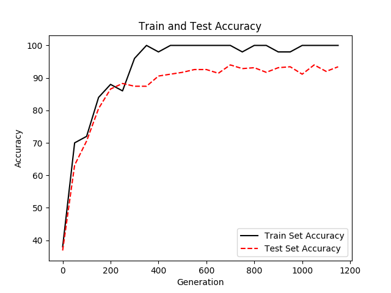

### Experiment Notes:
1. 7th Aug
   - When samples are added up to 500 from 220, the loss converges better.
   - Adjustment batch size cannot resolve the problem of sever oscillation of testing accuracy.
   - It might be possible to use more samples to train for a better performance.
2. 8th Aug
   - The result not good.
   - The original code is too naive, which simply read entire dataset into memory. Once the dataset is enlarged into a enormous scale, there will be problem with memory.
3. 9th Aug
   Thinking of the advance program:
   - The key part is the class `DataIterator` which is initialized with the directory of dataset.
   - For this crucial class, its method `input_pipeline` split the whole dataset and read it into memory. That's where we should pay attention and make some modification to read a 10-channel data. This method returns data for a batch and feed it into the network.
   - The funtion `build_graph` returns a variable of type dictionary taht contains valuable information and variables used of this model.
   
